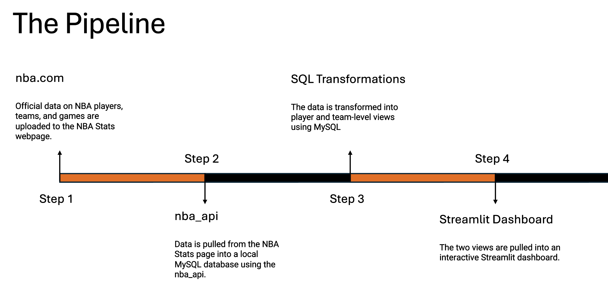

# team1-ADS507
Practical Data Engineering - Final Team Project


## Overview
This Project is a comprehensive NBA statistics analysis system with a focus on hustle stats. Here's the project structure and its main components:

    Database Configuration and Setup:
        The project uses MySQL as the database.
        Environment variables are used for database credentials.
        There's a setup script to create and populate the database.

    Data Ingestion:
        The system fetches data from the NBA API for players, teams, and hustle stats.
        It uses the nba_api library to interact with the NBA's official API.
        There are retry mechanisms and error handling for API requests.

    Data Models:
        The database schema includes tables for players, teams, and hustle stats.

    Scripts:
        There are scripts for initial setup and data updates.
        The main.py file allows users to choose between initial setup and updates.

    Web Application:
        The project includes a Streamlit-based web application for data visualization.
        It has separate dashboards for team and player comparisons.
        The app uses Plotly for creating interactive charts.

    Error Handling and Logging:
        The code includes extensive error handling and logging throughout.

    Performance Considerations:
        The app uses caching for database queries to improve performance.

    Security:
        Database credentials are stored in environment variables.
        SQL queries use parameterized inputs to prevent SQL injection.


## Contents
```plaintext
team1-ADS507/nba_dash/ 
├── database/
│   ├── __init__.py
│   ├── config.py
│   ├── setup_database.py
│   ├── schema.sql
│   └── data.sql
├── data_ingestion/
│   ├── __init__.py
│   ├── fetch_hustle_stats.py
│   ├── fetch_players.py
│   └── fetch_teams.py
├── scripts/
│   ├── __init__.py
│   ├── initial_setup.py
│   └── update.py
├── app/
│   ├── __init__.py
│   ├── database_utils.py
│   ├── monitoring_dashboard.py
│   ├── main_menu.py
│   ├── team_dashboard.py
│   └── player_dashboard.py
├── main.py
└── requirements.txt
```


## Pipeline Deployment


## Pipeline Monitoring